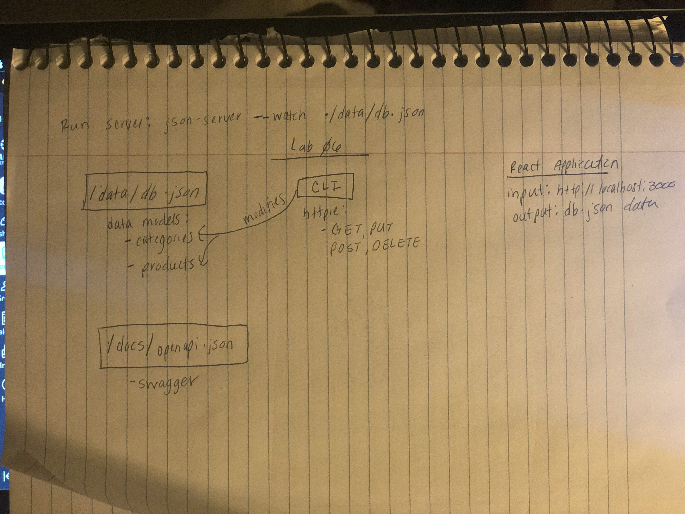
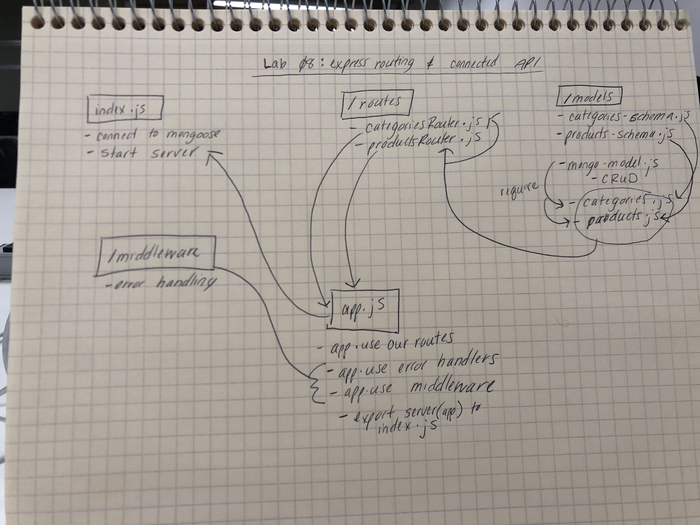

## Simple API

### Author: Susanna Lakey

### Links and Resources
* [submission PR](https://github.com/susannalakey-401-advanced-javascript/simple-api/compare/simple-api?expand=1)

#### Documentation
* [Swagger Documentation](https://app.swaggerhub.com/apis/slakeyj/simple-api/0.1)

### Setup
* `npm install json-server`
* `npm install httpie`
* `npm install cors morgan dotenv mongoose @code-fellows/supergoose mongodb`

#### How to initialize/run your server app (where applicable)
* `npm start`
  
#### Tests
* `npm test`

#### Stat mongo server
* `mongod --dbpath ./db`

#### UML

